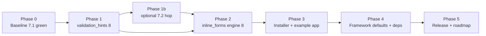

# Rails 8 migration — combined checklist

**Goal:** both gems and the `--example` installer path run on **Rails 8.0.x** (Ruby ≥ 3.2).

**Prerequisite:** complete [`rails-7.2-zeitwerk-plan.md`](rails-7.2-zeitwerk-plan.md) (latest Rails 7.2 + Zeitwerk on the 7.x line).

**Canonical copy:** this file (`validation_hints/stuff/rails-8-checklist.md`).  
**Mirror:** `inline_forms/stuff/rails-8-checklist.md` — keep in sync when editing.

**Related (do not duplicate here):**

| Doc | Purpose |
|-----|---------|
| [`stuff/roadmap.md`](roadmap.md) | Day-to-day backlog; add a Phase 7 pointer when work starts |
| `inline_forms/stuff/towards_rails_8.md` | Post-8 product bets (auth, encryption, authorization) — **after** this checklist |
| `inline_forms/stuff/pipeline.md` | Asset pipeline modernization (orthogonal; can run in parallel late in Phase 4) |
| `inline_forms/docs/ujs-to-turbo.md` | Turbo migration — **done** on 7.x; re-verify frame flows on 8 |

**Last updated:** 2026-05-19

| Gem | Current | Target (release) |
|-----|---------|------------------|
| **validation_hints** | 7.0.0, AR `>= 7.1.5`, `< 7.2` | **8.0.0**, AR `>= 8.0`, `< 8.1` |
| **inline_forms** | 7.10.2, Rails `>= 7.1.5`, `< 7.2` | **8.0.0**, Rails `>= 8.0`, `< 8.1` |

Official upgrade path: [Upgrading Ruby on Rails](https://guides.rubyonrails.org/upgrading_ruby_on_rails.html) recommends stepping **one minor at a time**. We are on **7.1**; optional **7.2** hop is listed in Phase 1 — skip only if 8.0 green tests prove parity.

Check items off as completed (`[x]`).

---

## Pathway (dependency order)



**Rule:** ship **validation_hints 8.x** before widening **inline_forms** to require it. Never pin `path:` gems in released installer Gemfiles (RubyGems / version pins only).

---

## Phase 0 — Baseline (Rails 7.1, both repos)

- [ ] **validation_hints:** `rvm use .` → `bundle exec rake test` — record runs / assertions / failures
- [ ] **inline_forms:** `bundle exec rake test` (or project default) — green
- [ ] **Example app gate:** build `inline_forms` gem → install in `/home/code/testInline` → `inline_forms create MyApp -d sqlite --example` → `bundle exec rails test` — record summary (expect **74 runs, 412 assertions** on current 7.10.x)
- [ ] **inline_forms.gemspec:** widen `validation_hints` to `>= 6.3, < 8.0` if still `< 7.0` (required to bundle validation_hints **7.0.0** on 7.1)
- [ ] **Bundler audit:** note advisories on 7.1.x; list gems that need version bumps for 8 (see Phase 4 table)
- [ ] Branch strategy agreed (e.g. `rails-8` in both repos, validation_hints merged first)

---

## Phase 1 — validation_hints → Rails 8

### 1.1 Gemspec & bundle

- [ ] `validation_hints.gemspec`: `activerecord` / dev deps `>= 8.0`, `< 8.1`
- [ ] `bundle update activerecord activemodel activesupport`
- [ ] `lib/validation_hints/version.rb` → **8.0.0** when AR constraint ships
- [ ] `CHANGELOG.md` — Rails 8 requirement, note inline_forms must pin `validation_hints ~> 8.0`

### 1.2 Active Model / AR compatibility audit

- [ ] Re-read Rails 8 release notes for **ActiveModel::Errors** / message generation — diff `Error.generate_message` vs `lib/active_model/hints.rb#generate_message`
- [ ] Re-run validator key mapping (`demodulize.underscore.delete_suffix("_validator")`) against 8.0 built-in validators
- [ ] Confirm **frozen** `validator.options` handling still passes (7.x regression tests)
- [ ] `enum` keyword-arg removal (Rails 8): N/A in gem code; document if host apps use old enum style
- [ ] Railtie / `ActiveSupport.on_load(:active_model)` — still fires before patch

### 1.3 Tests & smoke

- [ ] `test/test_helper.rb` — load Active Record **8.0** (in-memory SQLite)
- [ ] `bundle exec rake test` — full suite green; record summary
- [ ] `stuff/smoke_test.sh` — passes on Rails 8
- [ ] README: requirements `Rails / Active Record 8.0.x`

### 1.4 Release artifact

- [ ] `gem build validation_hints.gemspec`
- [ ] Install built `.gem` into `/home/code/testInline` gemset (no `path:` in consumer Gemfiles)

---

## Phase 1b — Optional intermediate: Rails 7.2 *(both repos)*

Skip if going **7.1 → 8.0** directly with full regression green.

- [ ] validation_hints: AR `>= 7.2`, `< 7.3` — test, tag **7.2.0** (optional)
- [ ] inline_forms: `rails` `>= 7.2`, `< 7.3` — engine tests + example app
- [ ] Installer: `load_defaults 7.2`, `Migration[7.2]`
- [ ] `bin/inline_forms`: prefer `rails` **7.2.x** for `rails new` when present

---

## Phase 2 — inline_forms engine → Rails 8

### 2.1 Gemspec & dependencies

- [ ] `inline_forms.gemspec`:
  - [ ] `rails` `>= 8.0`, `< 8.1`
  - [ ] `rails-i18n` `>= 8.0`, `< 9.0`
  - [ ] `validation_hints` `>= 8.0`, `< 9.0`
- [ ] `lib/inline_forms/version.rb` → **8.0.0** when stack ships
- [ ] `bundle update` in gem dev environment

### 2.2 Engine & library code

- [ ] `lib/inline_forms.rb` — engine, initializers, `ValidationHints::ValidationsPatch` load order on 8
- [ ] `lib/generators/inline_forms_generator.rb` — `Rails::Generators::GeneratedAttribute` patch; generator runs under 8
- [ ] Controllers / concerns: `turbo_rails/frame` layout paths unchanged
- [ ] Remove or update comments referencing Rails 7.0 / 7.1-only workarounds
- [ ] `test/` — full suite on Rails 8

### 2.3 Installer generator (`bin/`, templates)

- [ ] `bin/inline_forms` — prefer locally installed **`rails` 8.0.x** for `rails new` (replace 7.0.x selector at ~line 126)
- [ ] `bin/inline_forms_installer_core.rb`:
  - [ ] **Stop** rewriting `config.load_defaults` to 7.1 — set **`8.0`**
  - [ ] **Stop stripping** `config.autoload_lib(...)` (required on 8; was stripped for 7.0 compat)
  - [ ] Update header comments (remove 7.0 / `Unknown version "8.0"` narrative)
  - [ ] `gem 'rails', '~> 8.0.0'` (or `~> 8.0` per team pin)
  - [ ] `gem 'rails-i18n', '~> 8.0'`
  - [ ] `gem 'validation_hints', '~> 8.0'`
  - [ ] All `ActiveRecord::Migration[7.1]` → **`[8.0]`** (Devise, join tables, views, seeds)
- [ ] Example app tests under `lib/installer_templates/example_app_tests/` — pass when copied into MyApp on 8

---

## Phase 3 — Example app & third-party stack

Verify each installer-pinned gem supports Rails 8 before declaring Phase 3 done.

| Gem | Current pin | Rails 8 action |
|-----|-------------|----------------|
| `devise` | `~> 5.0` | Confirm 5.x + Rails 8 matrix; run `devise:install` flow |
| `devise-i18n` | `~> 1.16` | Version / fork check |
| `paper_trail` | `~> 16.0` | Run install + rich-text initializer; YAML safe-load still valid |
| `carrierwave` | `~> 3.1` | README claims 6–8; exercise image field in example tests |
| `foundation-rails` | `~> 6.9` | Dart Sass build under 8 |
| `dartsass-rails` | unpinned | `rails dartsass:install` in fresh app |
| `turbo-rails` | unpinned | Frame + Drive tests (see `example_app_turbo_*`) |
| `cancancan` | unpinned | `check_authorization` in generated `ApplicationController` |
| `tabs_on_rails` | git fork | **High risk** — confirm branch works on 8 or replace |
| `i18n-active_record` | git | Confirm fork loads on 8 |
| `importmap-rails` / `sprockets-rails` | unpinned | Hybrid pipeline still boots |
| `minitest` | `~> 5.25` | Rails 8 still expects Minitest 5 (not 6.x) |
| `sqlite3` | `~> 1.4` | Adapter still required for example app |

### 3.1 Generated app config

- [ ] Fresh `inline_forms create MyApp -d sqlite --example` on **Rails 8** system gem (no manual `application.rb` surgery)
- [ ] `config/application.rb`: `load_defaults 8.0`, `autoload_lib` present
- [ ] `bundle install` — no resolution errors
- [ ] **Do not** run `db:migrate` unless explicitly requested; schema load via test suite is enough
- [ ] `bundle exec rails test` in MyApp — **0 failures**; record runs / assertions

### 3.2 Browser spot-check (manual)

- [ ] Login `admin@example.com` / `admin999`
- [ ] Inline edit, nested photos pagination, Turbo frames, validation hint tooltips

---

## Phase 4 — Framework defaults & cleanup

- [ ] **Dart Sass / SCSS (installer noise):** `inline_forms create --example` runs `dartsass:build` with hundreds of deprecation warnings (`@import`, `lighten()`, global builtins) from Foundation + `inline_forms` SCSS. Accept on 7.x for now; before **Dart Sass 3.0** migrate entry SCSS to `@use` / `color.scale` (see `inline_forms/stuff/rails-8-checklist.md` mirror note)
- [ ] Run `rails app:update` in a scratch 8 app; diff `config/initializers/new_framework_defaults_8_0.rb` — decide what the installer should set explicitly vs leave commented
- [ ] Review Rails 8 removals affecting inline_forms:
  - [ ] `form_with` / `model:` nil — audit templates
  - [ ] Deprecated `ActionController` config flags — none in engine
  - [ ] `ActiveRecord::ConnectionAdapters::ConnectionPool#connection` — search codebase
- [ ] **Security:** `bundle exec bundler-audit` on 8 Gemfile.lock (both gems + MyApp)
- [ ] Remove obsolete **7.0→7.1** defensive code paths only after 8 is default (installer + `bin/inline_forms` comments)
- [ ] `stuff/pipeline.md` — optional: PropShaft / importmap-only follow-up (not a blocker for 8.0)

---

## Phase 5 — Release & documentation

### validation_hints 8.0.0

- [ ] Tag `v8.0.0`
- [ ] Publish to RubyGems (if applicable)

### inline_forms 8.0.0

- [ ] `CHANGELOG.md` — Rails 8, validation_hints 8, installer pins, test counts
- [ ] `README.rdoc` — stack version table
- [ ] Tag `v8.0.0`
- [ ] Publish to RubyGems (if applicable)

### Roadmap hygiene

- [ ] Update `stuff/roadmap.md` (both repos): version table, Phase 7 “Rails 8” → completed or archived
- [ ] Mark this checklist Phase 0–5 items `[x]` or move completed sections to “Reference only”
- [ ] `stuff/analysis.md` (validation_hints) — version references

---

## Verification commands (copy-paste)

```bash
# validation_hints
cd /home/code/validation_hints
rvm use .
bundle exec rake test
./stuff/smoke_test.sh

# inline_forms gem tests
cd /home/code/inline_forms
rvm use .
bundle exec rake test

# Example app (after build + install gem)
cd /home/code/inline_forms
rvm use .
gem build inline_forms.gemspec
cd /home/code/testInline
rvm use .
gem install /home/code/inline_forms/inline_forms-*.gem
rm -rf MyApp
inline_forms create MyApp -d sqlite --example
cd MyApp
rvm use .
bundle exec rails test
```

---

## Risk register

| Risk | Mitigation |
|------|------------|
| System `rails new` is 8.x but Gemfile still 7.1 | Fixed in Phase 2/3: align generator version, Gemfile, and `load_defaults` |
| `tabs_on_rails` / `i18n-active_record` git deps | Spike in scratch app early Phase 3; fork or replace before release |
| `generate_message` drift in AR 8 | Phase 1.2 audit + keep parity tests with Rails error messages |
| Asset pipeline hybrid (Sprockets + importmap + CDN Trix) | Not blocking 8.0; track in `pipeline.md` |
| Major version jumps confuse consumers | Clear CHANGELOG; inline_forms 8 requires validation_hints 8 |

---

## Out of scope for this checklist

Tracked in `inline_forms/stuff/towards_rails_8.md` **after** Rails 8 ships:

- Devise → Rodauth / native auth / IdP
- CanCan → Pundit / Action Policy
- Active Record encryption rollout
- jQuery → Stimulus full migration
- Hint copy / prescriptive tooltips (`roadmap.md` Phase 1)

Update this file as items complete or scope changes.
